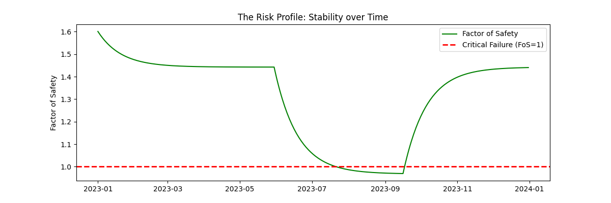

# Probabilistic Slope Stability & Landslide Risk Engine

### 🚨 Mission Objective
To determine the Annual Probability of Failure ($P_f$) of a hillside by simulating the temporal interaction between monsoon rainfall, groundwater fluctuations, and soil mechanics.

### 📉 The "Risk Profile"


### 🛠️ Tech Stack
*   **Engine:** Python 3.11
*   **Simulation:** NumPy, Pandas
*   **Physics:** Infinite Slope Analysis (Effective Stress Principle)
*   **Risk Framework:** AGS 2007 (Australian Geomechanics Society)
*   **Visualization:** Matplotlib

### ⚙️ Engineering Logic
1.  **Hydrology (The Bucket Model):** Simulated a 365-day Monsoon cycle using a decay function to model **Antecedent Moisture**. This accounts for the lag time between rainfall and groundwater rise.
2.  **Physics (Infinite Slope):** Applied **Terzaghi’s Principle of Effective Stress**. Calculated the Factor of Safety (FoS) for every single day based on the dynamic water table height.
    *   *Mechanism:* Rainfall $\to$ Rising Water Table ($u$) $\to$ Reduced Effective Stress ($\sigma'$) $\to$ Loss of Friction $\to$ Failure.
3.  **Risk Analysis:** Quantified risk not by a single snapshot, but by **Exposure Time**.
    *   $P_f = \frac{\text{Days}(FoS < 1.0)}{365}$
    *   Classified risk using **Consequence Classes** (Low/Medium/High Asset Value).

### 🚀 How to Run
1.  Clone the repository.
2.  Install dependencies:
    ```bash
    pip install -r requirements.txt
    ```
3.  Execute the simulation:
    ```bash
    python src/main.py
    ```

### 📊 Results (Representative Run)*
*   **Simulation Duration:** 1 Year (Synthetic Monsoon generated via Monte Carlo sampling)
*   **Critical Failure Days:** ~`58` Days (varies by weather pattern)
*   **Annual Probability of Failure ($P_f$):** **~`16.0`%**
*   **Verdict (Residential Asset):** **CRITICAL - IMMINENT DANGER (AGS Zone: Very High)**

### 📂 Data Provenance
*   **Rainfall Source:** Synthetic Monte Carlo Generation (Exponential Distribution)
*   **Reproducibility:** Results generated using *Random Seed `42`*
*   **Standards:** AGS Guidelines for Landslide Risk Management (2007)
*   **Hydrological Parameters (The Bucket Model):**
    *   **Drainage Rate ($k_{drain}$):** `0.05` (5% daily dissipation). Represents natural soil permeability.
    *   **Infiltration Factor ($\alpha$):** `0.01` (100mm rain = 1.0m rise). Represents catchment sensitivity.
    *   **Geotechnical Soil Profile (Infinite Slope):**
    *   **Cohesion ($c'$):** `5.0` $kPa$ (Typical Sandy-Clay Colluvium).
    *   **Friction Angle ($\phi'$):** `30`$^\circ$.
    *   **Slope Angle ($\beta$):** `25`$^\circ$.
    *   **Unit Weight ($\gamma$):** `18.0` $kN/m^3$.
